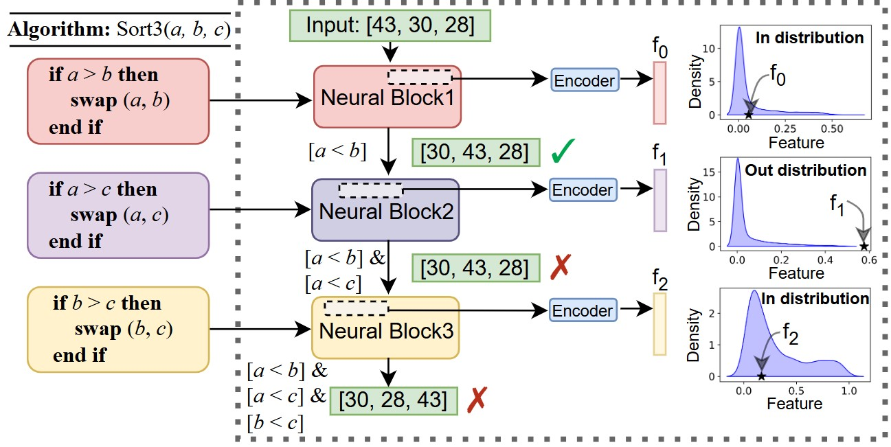

# Towards Algorithmically Grounded Embedded AI Models



This repository contains the official implementation of **Algorithm-Informed Neural Networks (AINNs)**, featuring three example applications:

- **Fractional Knapsack** [Tutorial](KNAPSACK/README.md)  
- **Fall Detection** [Tutorial](HMM/README.md)
- **Keyword Spotting** [Tutorial](DTW/README.md)

Each folder includes the corresponding **dataset**, **baseline models**, and **configurations** needed to reproduce the experiments.

## TODO
- [x] Add instructions/README
- [ ] Add detailed comments to each function
- [ ] Package the code as a modular AINN library


# Reference
If you find our work helpful, please consider citing it as follows.
```
@inproceedings{wang2025ainn,
  title     = {Towards Algorithmically Grounded Embedded AI Models},
  author    = {Wang, Zhenyu and Uddin, Md Yusuf Sarwar and Nirjon, Shahriar},
  booktitle = {Proceedings of the 24th ACM/IEEE International Conference on Embedded Artificial Intelligence and Sensing Systems},
  year      = {2026}
}
```
