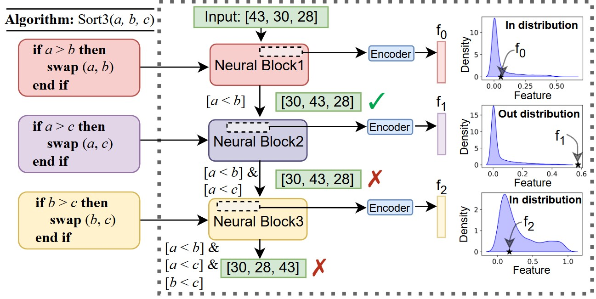

# Towards Algorithmically Grounded Embedded AI Models



This repository contains the official implementation of **Algorithm-Informed Neural Networks (AINNs)**, featuring three example applications:

- **Fractional Knapsack** [Tutorial](KNAPSACK/README.md)  
- **Fall Detection** [Tutorial](HMM/README.md)
- **Keyword Spotting** [Tutorial](DTW/README.md)

Each folder includes the corresponding **dataset**, **baseline models**, and **configurations** needed to reproduce the experiments.

## Quick Start -- Colab

You can also try it on Colab by starting with this Jupyter [notebook](https://colab.research.google.com/drive/1hUXuc5d0y9dtZFsrKOyICE-zxuPoZkYl?usp=sharing)

However, we strongly recommend running the code on a dedicated GPU machine or an HPC cluster using the environment specified in `requirements.txt`. While Colab is convenient for getting started, it can be difficult to manage package versions consistently and reproduce the exact environment, which may lead to suboptimal results.


# Reference
If you find our work helpful, please consider citing it as follows.
```
@inproceedings{ainn2026wang,
  author = {Wang, Zhenyu and Uddin, Md Yusuf Sarwar and Nirjon, Shahriar},
  title = {Short Paper: Towards Algorithmically Grounded Embedded AI Models},
  year = {2026},
  isbn = {9798400723094},
  publisher = {Association for Computing Machinery},
  address = {New York, NY, USA},
  url = {https://doi.org/10.1145/3774906.3800495},
  doi = {10.1145/3774906.3800495},
  booktitle = {Proceedings of the 2026 ACM/IEEE International Conference on Embedded Artificial Intelligence and Sensing Systems},
  pages = {478–487},
  numpages = {10},
  series = {SenSys '26}
}
```
